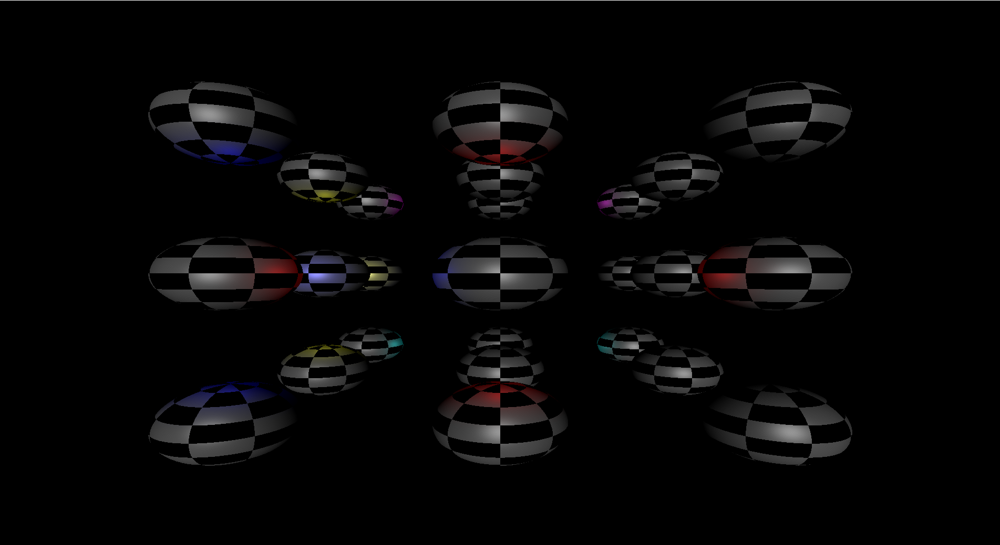

# LightRendering

This is a reference implementation of forward rendering, deferred rendering, and their tiled variants. Its not meant to be a exhaustive engine or fast implementations, but more of something you can copy to a different demo and build upon if wanted. I may decide to speed up some parts of the implementation at some point but for now its just a reference. The GBuffer formats are very unoptimized as well. The implementation currently only works on solid geometry but I will add transparent geometry as well as MSAA to all the techniques.

# How to Build

Theres a batch file in the code folder that can be run to build the program as well as generate all the shaders. You may have to adjust some of the paths to various files (will try to fix a bit of this later). The code polls for a libs directory. In there, it expects to have the following repositories I've created:

- Math
- Memory
- Graphics_Utils
- Framework_Vulkan

Some of the shaders might be commented out with REM but you can uncomment those for a first build. You might have to change the sln paths to match your build directory + make the data directory the working directory.

# TODO

- Make git ignore the contents of build_win32 except for the sln file (and make the paths in the sln relative)
- Make git auto pull the library dependencies to a libs folder
- Add tiled deferred rendering
- Add transparent objects to all renderers
- Add MSAA support to all renderers
- Add GPU profiling and maybe try out some optimizations
